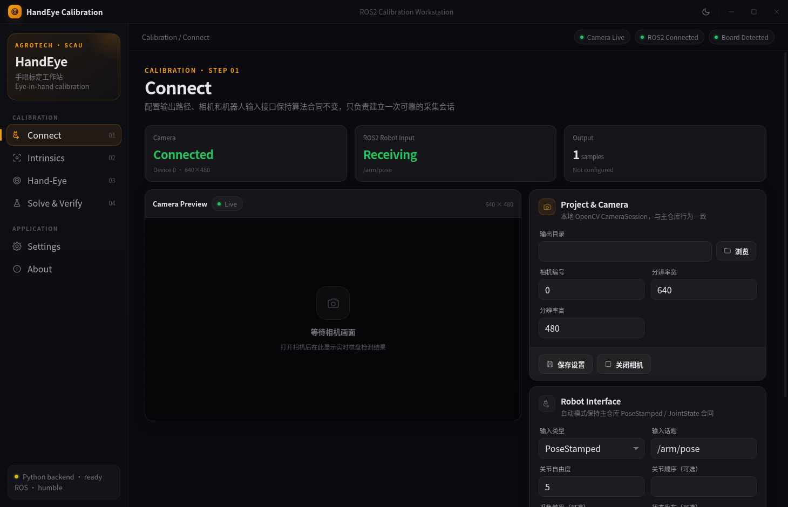

# HandEye Calibration App

HandEye Calibration App 是面向 ROS2 机械臂手眼标定的 Linux 桌面应用

GUI 参考 [Kudu](https://github.com/AdventDevInc/kudu) 的桌面设计语言，采用 Electron 自定义标题栏、侧边工作流、深色卡片、Amber 强调色和 Light / Dark / System 主题

标定核心以 [`AgroTech-SCAU/Handeye-Calibration-App`](https://github.com/AgroTech-SCAU/Handeye-Calibration-App) `main` 为基准，并通过 Git blob 校验保证冻结核心逐字节一致



## Features

- Electron Linux desktop app
- Kudu-inspired GUI
- Camera intrinsic calibration
- Eye-in-hand sample collection
- ROS2 `PoseStamped` and `JointState` input
- Manual pose and joint input
- Robust hand-eye solve
- OpenCV solve mode
- Bundle Adjustment solve mode
- Diagnose and verify workflow
- AppImage and deb release targets
- Core integrity verification

## Architecture

```text
Electron Renderer
      |
      v
Preload IPC
      |
      v
Electron Main
      |
      v
Python JSON Lines Bridge
      |
      +--> calibration_engine.py
      +--> algorithm_runner.py
      +--> ros_interface.py
      +--> algorithms/
```

Electron 负责桌面窗口、页面交互和状态展示

Python bridge 负责把 GUI 请求映射到标定核心与 ROS2 接口

Python 与 Electron 之间使用 stdin/stdout JSON Lines 通信，不需要本地 HTTP 服务或额外端口

## Supported Linux Platforms

| Ubuntu | ROS2 |
|---|---|
| 20.04 | Foxy |
| 22.04 | Humble |
| 24.04 | Jazzy |

ROS2 Python 使用系统 ROS2 对应的 Python ABI

源码安装会优先使用 `/usr/bin/python3` 创建带 `--system-site-packages` 的仓库本地虚拟环境

## Requirements

- Ubuntu 20.04 / 22.04 / 24.04
- Node.js 20 或 22
- npm
- Python 3
- `python3-venv`
- 对应 Ubuntu 的 ROS2 安装，用于 ROS2 自动采样
- 可访问的 V4L2 相机设备，用于 OpenCV 本地相机模式

## Install From Source

```bash
chmod +x install.sh launch.sh build_linux.sh start_ubuntu.sh uninstall.sh scripts/install-runtime.sh
./install.sh
```

安装脚本会创建仓库本地 Python 环境

```text
./.venv/
```

安装脚本先安装 Node package metadata，再单独下载 Electron 二进制，并在等待期间每 5 秒打印一次进度

Electron 二进制优先通过 `npmmirror` 获取，镜像不可用时自动回退到官方源

也可以手动指定 Electron 镜像

```bash
ELECTRON_MIRROR=https://npmmirror.com/mirrors/electron/ ./install.sh
```

## Run

```bash
./launch.sh
```

可以显式指定 ROS2 环境

```bash
ROS_SETUP=/opt/ros/humble/setup.bash ./launch.sh
```

`launch.sh` 会优先使用 `ROS_SETUP`，其次使用已激活的 `ROS_DISTRO`，最后根据 Ubuntu 版本或 `/opt/ros` 中的安装进行检测

## Calibration Workflow

### 01 Connect

设置输出目录、相机参数和机器人输入方式

ROS2 自动输入支持以下消息

| Input | ROS2 Type | Data |
|---|---|---|
| End-effector pose | `geometry_msgs/msg/PoseStamped` | xyz in m and quaternion xyzw |
| Joint state | `sensor_msgs/msg/JointState` | joint position in rad |
| Capture trigger | `std_msgs/msg/Bool` | optional |
| Status output | `std_msgs/msg/String` | optional JSON status |

### 02 Intrinsics

设置棋盘内角点列数、行数和方格尺寸后采集内参图像

支持 Minimal、Standard 和 Strict 三种采样质量模式

输出文件

```text
camera_intrinsics.yaml
```

### 03 Hand-Eye

固定棋盘后移动机械臂，在不同位置和姿态下采集图像与机器人位姿配对样本

输出文件

```text
samples.yaml
```

### 04 Solve

提供 Diagnose、Solve 和 Verify 操作

求解模式包括 Robust、OpenCV 和 Bundle Adjustment

输出文件

```text
samples_result.yaml
```

Eye-in-hand 结果约定

```text
^gripper T_camera
```

## Core Logic Integrity

运行核心逻辑一致性检查

```bash
python3 scripts/verify_core.py
```

期望输出

```text
CORE INTEGRITY: PASS (11 files match GitHub main byte for byte)
```

核心完整性检查覆盖以下冻结文件

这些文件保持与 GitHub main 字节一致，因此仓库写作格式约束不改写这些冻结核心文件

```text
algorithm_runner.py
calibration_engine.py
config.py
ros_interface.py
algorithms/bundle_adjust.py
algorithms/calib_utils.py
algorithms/diagnose.py
algorithms/fk_utils.py
algorithms/robot_params.yaml
algorithms/solve.py
algorithms/verify.py
```

## Test

```bash
python3 -m unittest discover -s tests -v
node scripts/verify_static.js
python3 scripts/verify_core.py
```

安装 Chromium 或 Chrome 后可以运行 Renderer smoke test

```bash
npm run smoke:renderer
```

## Build Linux Release

```bash
./install.sh
./build_linux.sh
```

构建目标

```text
AppImage x86_64
deb x86_64
```

构建产物位于

```text
dist/
```

如果 electron-builder 下载依赖失败，`build_linux.sh` 会自动使用 `npmmirror` 重试 release 二进制依赖

也可以手动指定镜像

```bash
ELECTRON_MIRROR=https://npmmirror.com/mirrors/electron/ \
ELECTRON_BUILDER_BINARIES_MIRROR=https://npmmirror.com/mirrors/electron-builder-binaries/ \
./build_linux.sh
```

## Project Layout

```text
Handeye-Calibration-App/
├── algorithm_runner.py
├── calibration_engine.py
├── config.py
├── ros_interface.py
├── algorithms/
├── backend/
│   └── bridge.py
├── desktop/
│   ├── main.js
│   └── preload.js
├── src/renderer/
│   ├── index.html
│   ├── app.js
│   └── styles.css
├── resources/
│   └── icon.png
├── scripts/
├── tests/
├── install.sh
├── launch.sh
├── build_linux.sh
└── package.json
```

## GUI Design Reference

GUI 的视觉结构参考 Kudu，包括侧边导航、卡片层级、Amber accent、暗色页面背景、状态色、轻量动画和主题切换

项目只参考设计语言和交互组织方式，不依赖 Kudu 运行时

## Contributing

GUI、桥接层、测试和 Release 配置可以独立迭代

涉及标定数学、质量门限、FK 参数、ROS2 数据语义或 YAML 数据格式的改动应独立提交并提供对应测试
