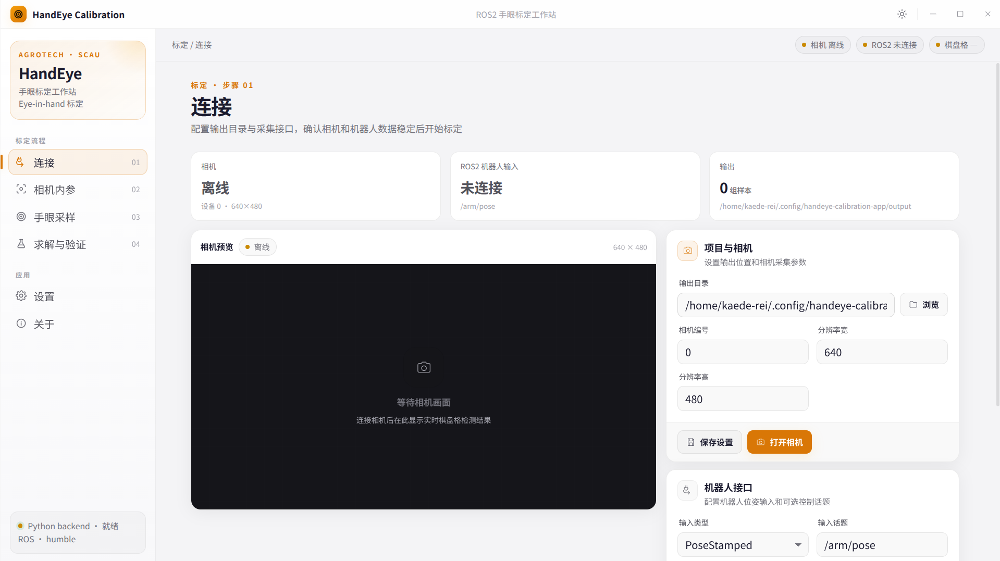

# HandEye Calibration App

> 面向 ROS2 机械臂的 Linux 桌面手眼标定应用，提供相机内参标定、Eye-in-Hand 样本采集、手眼求解、诊断与验证的一体化工作流



## 当前状态

- **状态：** 开发中
- **最新稳定版本：** 暂无
- **当前开发计划：** [`docs/plan.md`](docs/plan.md)

> 首次形成可复现的稳定版本后，再创建 Git Tag + GitHub Release，并将本 README 更新为该稳定版本的完整使用说明

> [!IMPORTANT]
> ## 参与本项目开发
>
> 推荐流程：
>
> **Issue → Branch → Commit → Push → Pull Request → 项目负责人 Merge**
>
> - 开始开发前，原则上先创建或认领 Issue
> - 从 Issue 的 `Development` 区域创建任务分支，或从最新 `main` 手动创建分支
> - 推荐分支名：`feat/xxx`、`fix/xxx`、`refactor/xxx`、`docs/xxx` 等；这是协作约定，不做硬性拦截
> - 请勿直接在 `main` 开发或 Push
> - 如果已经误在 `main` 上产生了有用 Commit，**不要先 `reset --hard`**，先按协作指南把提交保存到新分支
>
> 完整流程与常见问题：[`CONTRIBUTING.md`](.github/CONTRIBUTING.md)

## 1. 项目简介

HandEye Calibration App 是面向 ROS2 机械臂手眼标定的 Linux 桌面应用

GUI 参考 [Kudu](https://github.com/AdventDevInc/kudu) 的桌面设计语言，采用 Electron 自定义标题栏、侧边工作流、深色卡片、Amber 强调色以及 Light / Dark / System 主题；项目仅参考其设计语言和交互组织方式，不依赖 Kudu 运行时

标定核心以 [`AgroTech-SCAU/Handeye-Calibration-App`](https://github.com/AgroTech-SCAU/Handeye-Calibration-App) `main` 为基准，并通过 Git blob 校验保证冻结核心逐字节一致

### 主要能力

- Electron Linux desktop app
- 简体中文 / English 界面切换
- Camera intrinsic calibration
- Eye-in-hand sample collection
- ROS2 `PoseStamped` 和 `JointState` 自动输入
- 手动位姿与关节输入
- Robust hand-eye solve
- OpenCV solve mode
- Bundle Adjustment solve mode
- Diagnose / Solve / Verify 工作流
- AppImage 与 deb Release 构建
- Core integrity verification

### 系统架构

```text
Electron Renderer
      |
      v
Preload IPC
      |
      v
Electron Main
      |
      v
Python JSON Lines Bridge
      |
      +--> calibration_engine.py
      +--> algorithm_runner.py
      +--> ros_interface.py
      +--> algorithms/
```

- Electron 负责桌面窗口、页面交互和状态展示
- Python bridge 负责把 GUI 请求映射到标定核心与 ROS2 接口
- Python 与 Electron 之间使用 stdin/stdout JSON Lines 通信，不需要本地 HTTP 服务或额外端口

### 适用场景

- ROS2 机械臂 Eye-in-Hand 手眼标定
- V4L2 相机内参采集与标定
- ROS2 自动位姿采样或手动输入采样
- 标定结果诊断、求解与验证

### 当前边界

- 当前文档明确支持 Eye-in-Hand 工作流
- ROS2 自动采样依赖对应 Ubuntu 版本可用的系统 ROS2 环境
- OpenCV 本地相机模式要求系统存在可访问的 V4L2 相机设备

## 2. 环境要求

### 软件

- **OS：** Ubuntu 20.04 / 22.04 / 24.04
- **ROS / Runtime：** ROS2 Foxy / Humble / Jazzy；Node.js 20 或 22；npm
- **Compiler / Python：** Python 3、`python3-venv`
- **关键依赖：** Electron、OpenCV；Renderer smoke test 需要 Chromium 或 Chrome

支持的平台组合：

| Ubuntu | ROS2 |
| --- | --- |
| 20.04 | Foxy |
| 22.04 | Humble |
| 24.04 | Jazzy |

ROS2 Python 使用系统 ROS2 对应的 Python ABI；源码安装会优先使用 `/usr/bin/python3` 创建带 `--system-site-packages` 的仓库本地虚拟环境

### 硬件（如适用）

- **主控：** 可运行 Ubuntu 20.04 / 22.04 / 24.04 的 Linux 主机
- **传感器：** V4L2 相机；ROS2 模式下由机器人系统提供末端位姿 / 关节状态
- **执行器：** ROS2 机械臂
- **接口：** V4L2；ROS2 `PoseStamped` / `JointState`，可选 Bool trigger 与 String status

## 3. 安装

源码安装：

```bash
chmod +x install.sh launch.sh build_linux.sh start_ubuntu.sh uninstall.sh scripts/install-runtime.sh
./install.sh
```

安装脚本会创建仓库本地 Python 环境：

```text
./.venv/
```

安装脚本先安装 Node package metadata，再单独下载 Electron 二进制，并在等待期间每 5 秒打印一次进度

Electron 二进制优先通过 `npmmirror` 获取，镜像不可用时自动回退到官方源；也可以手动指定 Electron 镜像：

```bash
ELECTRON_MIRROR=https://npmmirror.com/mirrors/electron/ ./install.sh
```

## 4. 构建（如适用）

构建 Linux Release：

```bash
./install.sh
./build_linux.sh
```

构建目标：

```text
AppImage x86_64
deb x86_64
```

构建产物位于：

```text
dist/
```

如果 `electron-builder` 下载依赖失败，`build_linux.sh` 会自动使用 `npmmirror` 重试 release 二进制依赖；也可以手动指定镜像：

```bash
ELECTRON_MIRROR=https://npmmirror.com/mirrors/electron/ \
ELECTRON_BUILDER_BINARIES_MIRROR=https://npmmirror.com/mirrors/electron-builder-binaries/ \
./build_linux.sh
```

## 5. 快速开始

### 启动应用

```bash
./launch.sh
```

如需显式指定 ROS2 环境：

```bash
ROS_SETUP=/opt/ros/humble/setup.bash ./launch.sh
```

`launch.sh` 会按以下顺序确定 ROS2 环境：

1. 优先使用 `ROS_SETUP`
2. 其次使用已激活的 `ROS_DISTRO`
3. 最后根据 Ubuntu 版本或 `/opt/ros` 中的安装进行检测

预期现象 / 结果：

- 启动 Electron 桌面应用
- 进入侧边工作流页面
- 可按 Connect → Intrinsics → Hand-Eye → Solve 的顺序完成标定

### 标定工作流

#### 01 Connect

设置输出目录、相机参数和机器人输入方式

ROS2 自动输入支持：

| Input | ROS2 Type | Data |
| --- | --- | --- |
| End-effector pose | `geometry_msgs/msg/PoseStamped` | xyz in m and quaternion xyzw |
| Joint state | `sensor_msgs/msg/JointState` | joint position in rad |
| Capture trigger | `std_msgs/msg/Bool` | optional |
| Status output | `std_msgs/msg/String` | optional JSON status |

#### 02 Intrinsics

设置棋盘内角点列数、行数和方格尺寸后采集内参图像

支持 Minimal、Standard 和 Strict 三种采样质量模式

输出文件：

```text
camera_intrinsics.yaml
```

#### 03 Hand-Eye

固定棋盘后移动机械臂，在不同位置和姿态下采集图像与机器人位姿配对样本

输出文件：

```text
samples.yaml
```

#### 04 Solve

提供 Diagnose、Solve 和 Verify 操作

求解模式包括 Robust、OpenCV 和 Bundle Adjustment

输出文件：

```text
samples_result.yaml
```

Eye-in-Hand 结果约定：

```text
^gripper T_camera
```

### 界面语言

Settings 页面提供简体中文和 English 两种界面语言

- 首次启动根据系统语言自动选择；系统语言为 `zh-*` 时使用简体中文，其余语言使用 English
- 用户手动选择后会保存偏好，后续启动继续使用上次选择的语言
- 语言切换仅刷新界面文案，不重启 Python backend，也不会断开当前 ROS2 与采样会话

## 6. 配置说明

### 启动与运行配置

| 配置项 | 默认值 / 行为 | 说明 |
| --- | --- | --- |
| `ROS_SETUP` | 自动检测 | 可显式指定 ROS2 `setup.bash` |
| `ELECTRON_MIRROR` | `npmmirror` 优先，失败回退官方源 | 控制 Electron 二进制下载镜像 |
| `ELECTRON_BUILDER_BINARIES_MIRROR` | 构建脚本自动处理 | 控制 electron-builder 二进制依赖镜像 |
| Python environment | `./.venv/` | 使用 `/usr/bin/python3` + `--system-site-packages` 创建 |
| GUI language | 按系统语言自动选择 | 可在 Settings 中切换并持久化 |

### Core Logic Integrity

运行核心逻辑一致性检查：

```bash
python3 scripts/verify_core.py
```

期望输出：

```text
CORE INTEGRITY: PASS (11 files match GitHub main byte for byte)
```

核心完整性检查覆盖以下冻结文件：

```text
algorithm_runner.py
calibration_engine.py
config.py
ros_interface.py
algorithms/bundle_adjust.py
algorithms/calib_utils.py
algorithms/diagnose.py
algorithms/fk_utils.py
algorithms/robot_params.yaml
algorithms/solve.py
algorithms/verify.py
```

这些文件保持与 GitHub `main` 字节一致，因此仓库写作格式约束不应改写这些冻结核心文件

### 测试

```bash
python3 -m unittest discover -s tests -v
node scripts/verify_static.js
python3 scripts/verify_core.py
```

安装 Chromium 或 Chrome 后可以运行 Renderer smoke test：

```bash
npm run smoke:renderer
```

## 7. 目录结构

```text
Handeye-Calibration-App/
├── README.md
├── docs/
│   └── plan.md
├── .github/
│   └── CONTRIBUTING.md
├── algorithm_runner.py
├── calibration_engine.py
├── config.py
├── ros_interface.py
├── algorithms/
├── backend/
│   └── bridge.py
├── desktop/
│   ├── main.js
│   └── preload.js
├── src/renderer/
│   ├── index.html
│   ├── app.js
│   └── styles.css
├── resources/
│   └── icon.png
├── scripts/
├── tests/
├── install.sh
├── launch.sh
├── build_linux.sh
└── package.json
```

## 8. 文档

- `docs/plan.md`：项目规划（按仓库规范维护）
- `.github/CONTRIBUTING.md`：成员协作流程与误操作急救
- `docs/images/handeye-desktop-white.png`：README GUI 展示图
- 本 README：安装、运行、标定工作流、构建与核心一致性检查说明

后续如项目需要，可继续补充：

- `docs/architecture.md`：系统架构
- `docs/interface.md`：接口说明
- `docs/deployment.md`：部署说明
- `docs/calibration.md`：标定说明
- `docs/troubleshooting.md`：故障排查

## 9. 常见问题

### Electron 下载失败

**现象：** `./install.sh` 在 Electron 二进制下载阶段失败

**原因：** 当前镜像或网络环境无法访问对应 Electron 资源

**处理：** 安装脚本默认优先使用 `npmmirror`，失败后会回退官方源；也可手动指定：

```bash
ELECTRON_MIRROR=https://npmmirror.com/mirrors/electron/ ./install.sh
```

### 启动时未找到正确的 ROS2 环境

**现象：** ROS2 自动输入不可用，或 `launch.sh` 未加载预期 ROS2 发行版

**原因：** 当前 shell 未激活 ROS2，且自动检测结果与实际环境不一致

**处理：** 显式指定：

```bash
ROS_SETUP=/opt/ros/humble/setup.bash ./launch.sh
```

### Renderer smoke test 无法运行

**现象：** `npm run smoke:renderer` 无法启动浏览器测试

**原因：** 系统未安装 Chromium 或 Chrome

**处理：** 安装 Chromium 或 Chrome 后重新执行 smoke test

## 10. 版本与发布

正式稳定版本使用 **Git Tag + GitHub Release** 发布

当前 README 未提供已发布的稳定版本号，因此暂按“开发中 / 暂无稳定版本”维护

版本历史见：[GitHub Releases](https://github.com/AgroTech-SCAU/Handeye-Calibration-App/releases)

## 11. 维护者

- Maintainer / 项目负责人：yjjy25
- Organization：[`AgroTech-SCAU`](https://github.com/AgroTech-SCAU)
